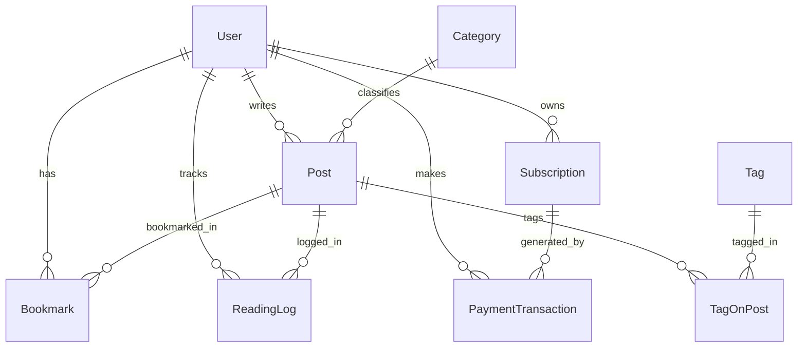

# 🚀 KẾ HOẠCH TRIỂN KHAI BACKEND & DATABASE — THINK & RICH
> **Tài liệu theo dõi tiến độ từng Sprint (Sprint Roadmap & Progress Tracker)**  
> **Dự án**: Think & Rich (*Mental Models & Strategic Decision Platform*)  
> **Kiến trúc**: Next.js 15 (App Router) + PostgreSQL + Prisma ORM + Server Actions + Resend + SePay & Lemon Squeezy  
> **Cập nhật lần cuối**: 2026-08-21  

---

## 📊 BẢNG TỔNG QUAN TIẾN ĐỘ CÁC SPRINT

| Sprint | Tên Sprint & Mục Tiêu | Trọng Tâm Kỹ Thuật | Trạng Thái | Tiến Độ |
| :---: | :--- | :--- | :---: | :---: |
| **Sprint 0** | **Kiến trúc CSDL & Cấu hình Prisma ORM** | PostgreSQL, Prisma Schema, Migration, Seed Data | 🟡 **SẴN SÀNG** | `0%` |
| **Sprint 1** | **Xác thực Đăng nhập Thật (Email OTP Engine)** | Resend API, JWT/Session, HTTP-only Cookie, RBAC | ⚪ Chờ thực hiện | `0%` |
| **Sprint 2** | **Quản lý Bài viết, CMS & Media Cloud Storage** | CRUD Post API, Cloudinary/S3, TipTap HTML Sanitize | ⚪ Chờ thực hiện | `0%` |
| **Sprint 3** | **Kiểm soát Hạn mức Đọc & Tủ sách Cá nhân** | Server-side Paywall Guard, Daily Quota, Bookmarks | ⚪ Chờ thực hiện | `0%` |
| **Sprint 4** | **Cổng Thanh Toán Thực (SePay & Lemon Squeezy)** | Webhook Security HMAC, VietQR, Subscriptions DB | ⚪ Chờ thực hiện | `0%` |
| **Sprint 5** | **Tối ưu Hóa, Bảo Mật & Đóng Gói Triển Khai** | Redis Cache, Zod Validation, Rate Limit, Vercel/DB | ⚪ Chờ thực hiện | `0%` |

---

## 🏗️ KIẾN TRÚC DỮ LIỆU TỔNG THỂ (DATABASE SCHEMA BLUEPRINT)

---

## 📋 CHI TIẾT TỪNG SPRINT & CHECKLIST THỰC HIỆN

### 🟡 SPRINT 0: Kiến trúc Cơ sở Dữ liệu & Khởi tạo Prisma ORM
> **Mục tiêu**: Cài đặt ORM, kết nối PostgreSQL (Supabase/Neon/Local), sinh bảng CSDL chuẩn và nạp dữ liệu ban đầu (Seed Data).

- [ ] **0.1. Cài đặt thư viện ORM**:
  - [ ] Cài đặt `@prisma/client` và `prisma` (devDependencies).
  - [ ] Khởi tạo thư mục `prisma/schema.prisma` và file client singleton `src/lib/prisma.ts`.
- [ ] **0.2. Thiết kế Models trong Prisma Schema**:
  - [ ] `User`: Quản lý tài khoản, vai trò (`ADMIN`, `USER`), cấp độ gói (`FREE`, `PLUS`, `PRO`), ngày hết hạn.
  - [ ] `OtpCode`: Lưu mã OTP 6 số, thời hạn hết hạn (10 phút), trạng thái sử dụng (`used`).
  - [ ] `Category` & `Tag`: Quản lý danh mục mô hình tư duy và nhãn phân loại.
  - [ ] `Post`: Lưu trữ bài viết, slug, nội dung HTML, tóm tắt, cấp độ truy cập (`FREE`, `MEMBER`), video URL, số lượt xem/thích.
  - [ ] `Bookmark`: Lưu các bài viết độc giả đã thêm vào tủ sách cá nhân.
  - [ ] `ReadingLog`: Lưu lịch sử bài viết đã đọc kèm ngày đọc (để tính quota bài/ngày).
  - [ ] `Subscription`: Quản lý trạng thái thuê bao năm, ngày bắt đầu, ngày kết thúc, gateway sử dụng (`sepay` / `lemonsqueezy`).
  - [ ] `PaymentTransaction`: Lưu nhật ký giao dịch ngân hàng/thẻ, mã tham chiếu, số tiền, tiền tệ, trạng thái (`PENDING`, `COMPLETED`, `FAILED`).
  - [ ] `PlatformSetting`: Lưu cấu hình thương hiệu, màu sắc, API keys thanh toán mã hóa.
- [ ] **0.3. Migration & Seeding**:
  - [ ] Chạy lệnh `npx prisma migrate dev --name init_db`.
  - [ ] Viết script `prisma/seed.ts` để chuyển toàn bộ 8 bài viết & 8 danh mục mô hình tư duy mẫu từ `data.ts` vào PostgreSQL.
  - [ ] Kiểm tra bằng công cụ Prisma Studio (`npx prisma studio`).

---

### ⚪ SPRINT 1: Xác thực Người dùng Thật (Production Email OTP Engine)
> **Mục tiêu**: Thay thế Mock OTP bằng hệ thống gửi email OTP thực tế qua Resend/SMTP và bảo mật phiên bằng Server Session / JWT.

- [ ] **1.1. Cấu hình Email Provider (Resend API)**:
  - [ ] Cài đặt `resend` SDK.
  - [ ] Tạo template HTML Email gửi mã OTP 6 số đẹp mắt, có thương hiệu Think & Rich.
- [ ] **1.2. Server Actions / API Routes cho Auth**:
  - [ ] `POST /api/auth/send-otp`: Kiểm tra định dạng email, tạo mã 6 số ngẫu nhiên có hạn 10 phút, lưu hash vào DB và gửi email.
  - [ ] `POST /api/auth/verify-otp`: Kiểm tra mã OTP, tạo mới hoặc cập nhật User, cấp Session Token lưu vào `HTTP-only Cookie` an toàn chống XSS.
  - [ ] `POST /api/auth/logout`: Xóa session cookie, vô hiệu hóa phiên.
  - [ ] `GET /api/auth/me`: Trả về thông tin người dùng hiện tại từ Database.
- [ ] **1.3. Phân quyền truy cập (RBAC Guard & Middleware)**:
  - [ ] Viết `src/middleware.ts` bảo vệ route `/admin` (chỉ cho phép role `ADMIN`).
  - [ ] Cập nhật `AuthDialog.tsx` gọi API thực tế và xử lý đếm ngược gửi lại OTP (Resend cooldown).

---

### ⚪ SPRINT 2: Quản lý Bài viết, CMS & Media Cloud Storage
> **Mục tiêu**: Lưu trữ bài viết thật vào PostgreSQL, tích hợp Upload hình ảnh lên Cloud Storage và Sanitize nội dung bảo mật.

- [ ] **2.1. Tích hợp Cloud Storage cho Media**:
  - [ ] Cấu hình Cloudinary / Supabase Storage / AWS S3 để upload ảnh đại diện bài viết và tài liệu đính kèm.
  - [ ] API endpoint `POST /api/upload` nhận tệp từ TipTap Editor, nén ảnh WebP và trả về URL CDN.
- [ ] **2.2. Xây dựng CRUD API cho Bài viết & Danh mục**:
  - [ ] `GET /api/posts`: Hỗ trợ phân trang, lọc theo danh mục, trạng thái đọc, tìm kiếm full-text search.
  - [ ] `GET /api/posts/[slug]`: Lấy chi tiết bài viết, tự động tăng `views` có rate-limiting.
  - [ ] `POST /api/admin/posts`: Tạo bài viết mới (Admin).
  - [ ] `PUT /api/admin/posts/[id]`: Cập nhật bài viết, slug, SEO tags, video URL (Admin).
  - [ ] `DELETE /api/admin/posts/[id]`: Xóa bài viết hoặc chuyển vào thùng rác (`DRAFT` / `ARCHIVED`).
- [ ] **2.3. Sanitize HTML & Chống XSS**:
  - [ ] Sử dụng `dompurify` / `sanitize-html` ở phía server để lọc các thẻ mã độc trước khi lưu vào Database.

---

### ⚪ SPRINT 3: Kiểm soát Hạn mức Đọc & Tủ sách Cá nhân (Server-side Paywall)
> **Mục tiêu**: Đảm bảo an toàn 100% cho các bài viết Member và chặn bypass bằng cách kiểm tra quota bài đọc trực tiếp tại Server.

- [ ] **3.1. Server-side Paywall Guard**:
  - [ ] Xây dựng hàm kiểm tra quyền truy cập ở Server:
    * Người dùng chưa đăng nhập: Cắt ngắn nội dung (truncate), chỉ trả về 30% văn bản + `AUTH_REQUIRED`.
    * Người dùng gói `FREE`: Kiểm tra số bài đã đọc trong ngày (`ReadingLog` hôm nay $\le 10$). Nếu là bài `MEMBER` $\rightarrow$ Trả về `MEMBER_REQUIRED`. Nếu quá 10 bài $\rightarrow$ Trả về `DAILY_LIMIT_REACHED`.
    * Người dùng gói `PLUS`: Cho phép đọc bài `MEMBER`, giới hạn tối đa 15 bài/ngày.
    * Người dùng gói `PRO`: Toàn quyền đọc 100% không giới hạn.
- [ ] **3.2. API Tủ sách & Lịch sử Đọc**:
  - [ ] `POST /api/library/bookmark`: Thêm / Xóa bài viết khỏi tủ sách cá nhân (lưu vào DB).
  - [ ] `GET /api/library/bookmarks`: Lấy danh sách bài đã lưu của tài khoản.
  - [ ] `POST /api/library/read-history`: Ghi nhận nhật ký đọc bài viết vào bảng `ReadingLog`.
  - [ ] `POST /api/posts/[id]/react`: Thả tim / Bỏ thích bài viết (cập nhật số like thực trong DB).

---

### ⚪ SPRINT 4: Cổng Thanh Toán Thực & Xử lý Webhook (SePay & Lemon Squeezy)
> **Mục tiêu**: Tích hợp thanh toán thật, bảo mật Webhook bằng chữ ký số và tự động nâng cấp gói hội viên trong Database.

- [ ] **4.1. Tích hợp SePay (Thanh toán Nội địa Việt Nam - VNĐ)**:
  - [ ] Tạo bảng `PaymentTransaction` với mã memo duy nhất (ví dụ: `TR<USER_ID>_<TIMESTAMP>`).
  - [ ] Webhook endpoint `POST /api/webhooks/billing?gateway=sepay`:
    * Kiểm tra `API Key / Secret Token` trong header từ SePay.
    * Phân tích nội dung chuyển khoản để tìm `User` và `Gói đăng ký`.
    * Kiểm tra số tiền chuyển khớp với giá gói (`299.000đ` cho Plus hoặc `499.000đ` cho Pro).
    * Cập nhật `User.tier` lên `PLUS` hoặc `PRO`, cộng thời hạn 1 năm vào `User.tierExpiresAt`.
    * Lưu log giao dịch thành công.
- [ ] **4.2. Tích hợp Lemon Squeezy (Thanh toán Quốc tế - USD/EUR/JPY/KRW/TWD/CNY)**:
  - [ ] Tạo Checkout URL qua Lemon Squeezy API với `custom_data` chứa `userId`, `planId`, `countryCode`.
  - [ ] Webhook endpoint `POST /api/webhooks/billing?gateway=lemonsqueezy`:
    * Xác thực chữ ký HMAC SHA-256 (`x-signature`) từ Lemon Squeezy.
    * Lắng nghe các sự kiện: `subscription_created`, `order_created`, `subscription_cancelled`.
    * Tự động kích hoạt gói tương ứng cho `User` theo đúng loại tiền tệ quốc tế đã thu.

---

### ⚪ SPRINT 5: Tối ưu Hóa, Bảo Mật & Triển khai Production
> **Mục tiêu**: Đảm bảo hiệu năng cao, bảo vệ hệ thống trước tấn công và sẵn sàng chạy trên môi trường thực tế.

- [ ] **5.1. Tối ưu Hiệu năng & Cache**:
  - [ ] Cấu hình Next.js Incremental Static Regeneration (ISR) cho các bài viết để trang load dưới 100ms.
  - [ ] Tích hợp Redis / Upstash Cache cho dữ liệu đọc nhiều (Danh sách bài, đếm views, top bài viết).
- [ ] **5.2. Bảo mật & Giám sát**:
  - [ ] Validation toàn diện dữ liệu đầu vào bằng **Zod Schema**.
  - [ ] Cấu hình Rate Limiting chống spam API (Upstash Ratelimit hoặc Cloudflare).
  - [ ] Cấu hình CORS và Security Headers (`Content-Security-Policy`, `X-Frame-Options`).
- [ ] **5.3. Triển khai Production**:
  - [ ] Kết nối Database Production (Supabase PostgreSQL / Neon).
  - [ ] Cấu hình Environment Variables (`DATABASE_URL`, `RESEND_API_KEY`, `SEPAY_WEBHOOK_KEY`, `LEMON_SQUEEZY_KEY`).
  - [ ] Triển khai ứng dụng lên Vercel / Railway.

---

## 📌 HƯỚNG DẪN CẬP NHẬT TIẾN ĐỘ
Mỗi khi hoàn thành một nhiệm vụ, đánh dấu `[x]` vào mục tương ứng trong file này và cập nhật tỷ lệ `%` tại **Bảng tổng quan tiến độ** để đảm bảo tính minh bạch và kiểm soát chặt chẽ quy trình phát triển.
